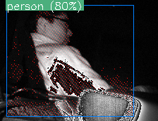

# Pico Flexx on RaspberryPi with royale_3.21.1.70

## [First move](FirstContact.md)
## [Working with OpenNI2](royale+openni2.md)
## Pico Flexx On RaspberryPi Model B+

### Running samples  
- Prepare  
  RaspberryPi Model B+  
  SDCard with Raspbian stretch(using 16GB SDCard)  

- Boot RaspberryPi  
  touch /boot/ssh  
  lcd_rotate=2 in /boot/config.txt  

- Connect Pico Flexx to USB port of RaspberryPi  

Check as USB device bellow,  

VenderID:1c28  
ProductID:c012
rivision:0000  
PMDtec FX3

```
$ dmesg | grep FX3
[  2.27900] usb 1-1.3: Product: FX3
```
linux recognizes Pico Flexx.  

- Update stretch

```
# apt update
# apt -y upgrade
```

- Prepare royale library  

Select one of two ways bellow,  

(1) Copy royale_3.21.1.70 to RaspberryPi(using WinSCP)

```
// Download zip library package from PMD Webpage and
$ unzip libroyale-3.21.1.70-LINUX-arm-32Bit.zip
$ cd libroyale-3.21.1.70-LINUX-arm-32Bit/driver/udev
# cp 10-royale-ubuntu.rules /etc/udev/rules.d
# reboot

```
**OR**  

(2) Use this repository  

```
$ cd 3.21.1.70/driver/udev
# cp 10-royale-ubuntu.rules /etc/udev/rules.d
# reboot
```

- Install requirement for Python3 library  

```
# apt install libpython3.4-dev
```

- Run sample as fist movement,

```
$ cd libroyale-3.21.1.70-LINUX-x86-64Bit/python
$ python3 sample_camera_info.py 
Number of cameras connected:  1
====================================
        Camera information
====================================
Id:              0007-0307-0107-2314
Type:            PICOFLEXX
Width:           224
Height:          171
Operation modes: 9
    MODE_9_5FPS_2000
    MODE_9_10FPS_1000
    MODE_9_15FPS_700
    MODE_9_25FPS_450
    MODE_5_35FPS_600
    MODE_5_45FPS_500
    MODE_MIXED_30_5
        this operation mode has 2 streams
    Low_Noise_Extended
    Fast_Acquisition
CameraInfo items: 8
    ('BRIDGE_TYPE', 'Enclustra')
    ('MODULE_IDENTIFIER', '00000000')
    ('MODULE_IDENTIFIER_HASH', '558161692')
    ('MODULE_SERIAL', '0')
    ('MODULE_SUFFIX', '')
    ('IMAGER', 'M2450_A12_AIO')
    ('PROCESSING_NAME', 'Spectre')
    ('PROCESSING_VERSION', '3.13.2.748')
```

If you met error bellow,  
```
Error : Can not find camera device
```

Error denote that flexx can not be established with USB port on stretch. Retry dmesg etc.  

- Run sample_retrieve_data  
If you have done *apt upgrade* now, python3-tk is already installed.  

```
$ pip3 install matplotlib
# apt install python3-tk

$ python3 sample_retrieve_data
...
isConnected True
getFrameRate 5
```
During 15sec flexx shots XYZ data.  
**Checking Samples done**.  

### Using OpenCV instead of matplotlib  

- Install OpenCV for Python3  
  All PMD providing samples work with matplotlib. If you want to use complex vision processing with Pico Flexx then you have to install OpenCV for Python3. But OpenCV for Python3 can not be installed via pip3.  
  Intel OpenVINO has provided OpenCV for Python3 and installation is too easy!.  So **you shoud use OpenVINO package to use OpenCV for Python3 only**.  

```
$ tar xzf l_openvino_toolkit_ie_p_2018.5.445.tgz
$ sed -i "s|<INSTALLDIR>|$(pwd)/inference_engine_vpu_arm|"  inference_engine_vpu_arm/bin/setupvars.sh
$ . inference_engine_vpu_arm/bin/setupvars.sh
[setupvars.sh] OpenVINO environment initialized
$ python3 -c "import cv2"
$
```
Silence is good response!  
As of now you've got OpenVINO environment too.  

```
$ python3 demo_camera.py
```


### Run PICO Flexx with Movidus Device via OpenVINO  

- Install SSD-Mobilenet OpenVINO environment  
```
    $ cd  
    $ git clone https://github.com/k5iogura/vinosyp  
```

- Run demo  
```
    $ cd libroyale-LINUX-arm/3.21.1.70/python  
    $ python3 demo_fx3_ssd_mobilenet.py  
```

- Demo script structure  

```
- From PICO Flexx device,  
get GrayScale image  
get Depth image  

- To Movidius device,  
send GrayScale image to Movidius device  
start inference engine  

- Merge GrayScale image and result of inference region box  
erase depth data without in inferred region box  
overlay depth data on GrayScale image  
```

**It seems like pixelwise segmentation task.**
**We used depth sensing results instead of segmentation NeuralNetwork model.**  



Log Messages bellow,  

```
Number of cameras connected:  1
====================================
        Camera information
====================================
Type:            PICOFLEXX
Width:           224
Height:          171
Operation modes: 9
    MODE_9_5FPS_2000
    MODE_9_10FPS_1000
    MODE_9_15FPS_700
    MODE_9_25FPS_450
    MODE_5_35FPS_600
    MODE_5_45FPS_500
    MODE_MIXED_30_5
        this operation mode has 2 streams
    Low_Noise_Extended
    Fast_Acquisition
CameraInfo items: 8
    ('BRIDGE_TYPE', 'Enclustra')
    ('MODULE_IDENTIFIER', '00000000')
    ('MODULE_IDENTIFIER_HASH', '558161692')
    ('MODULE_SERIAL', '0')
    ('MODULE_SUFFIX', '')
    ('IMAGER', 'M2450_A12_AIO')
    ('PROCESSING_NAME', 'Spectre')
    ('PROCESSING_VERSION', '3.13.2.748')
isConnected True
getFrameRate 45
View Gray Mode
== IENetwork.name MobileNet-SSD ==
n/c/h/w (from xml)= 1 3 300 300
input_blob : out_blob = data : detection_out
Gtk-Message: Failed to load module "canberra-gtk-module"
Gtk-Message: Failed to load module "canberra-gtk-module"
      1.91 FPS (ZQ/GQ:000/000)
finished
```

**Update Apr.03 2019**
